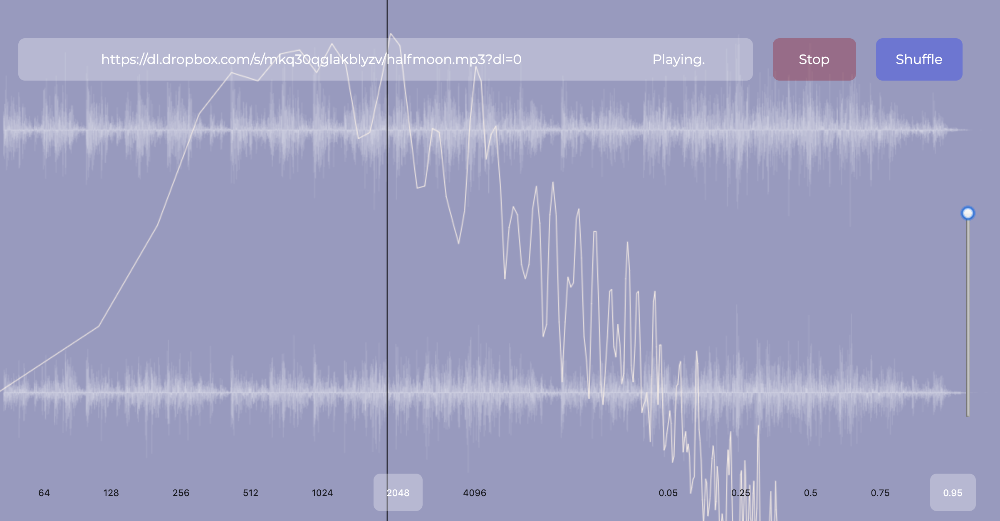

# Audio Analyser

This is a little web app for playing and visualising audio files.

By default, it will play my version of the superb piece [Ágúst](https://www.youtube.com/watch?v=LYvlmiwEP9M) by Ólafur Arnalds.

Paste a URL to any audio file on the web into the text input at the top to load and play it.

Once you have loaded in a new track, copy paste the URL from your browser's address bar to share it.

## Technical details

This is a minimal web app that **only runs in modern browsers that support ES6, including modules**. It does _not_ use a module bundler like
Webpack, and the only Javascript dependency is [React](https://reactjs.org/), which is included as a `script` tag in the HTML.

Babel is used, only to transpile JSX.

The primary motivations for this app were learning and investigating the [Web Audio API](https://developer.mozilla.org/en-US/docs/Web/API/Web_Audio_API) and
[React Hooks](https://reactjs.org/docs/hooks-intro.html).
